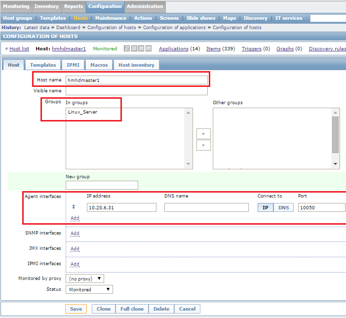
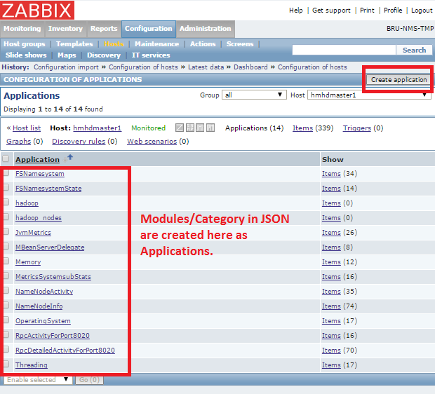
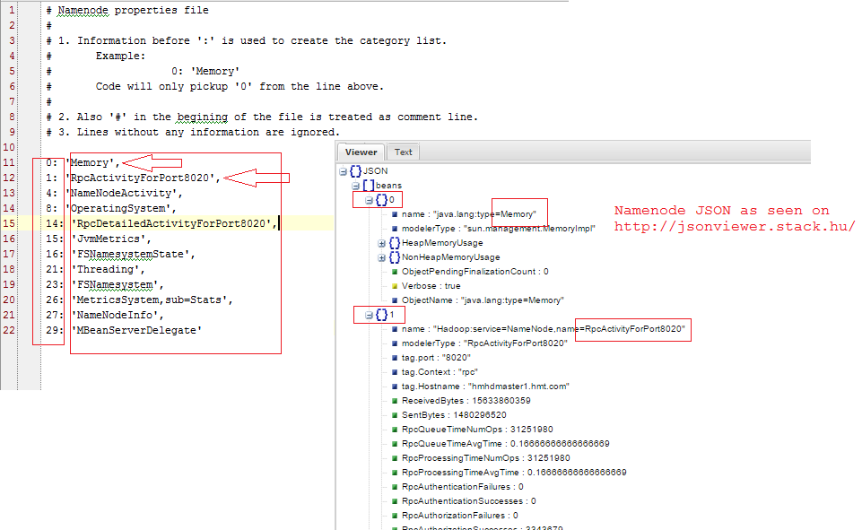
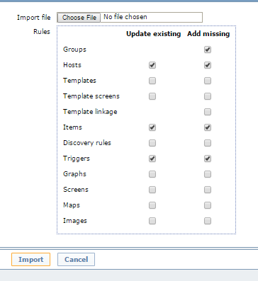

#Zabbix Hadoop Monitoring

---

Table of Contents

1. <a href="#Namenode Zabbix Monitoring">Namenode Zabbix Monitoring</a>
2. <a href="#Working with the script.">Working with the script.</a>
	 * <a href="#Step 1 - Generating Zabbix Import XML file.">Step 1 - Generating Zabbix Import XML file.</a>
	 * <a href="#Step 1.1 Create Host in Zabbix.">Step 1.1 Create Host in Zabbix.</a>
	 * <a href="#Step 1.2 Create Application for this (hmhdmaster1) Host in Zabbix.">Step 1.2 Create Application for this (hmhdmaster1) Host in Zabbix.</a>
	 * <a href="#Step 1.3 Updating properties file [if required (As of now can be left alone)]">Step 1.3 Updating properties file [if required (As of now can be left alone)]</a>
	 * <a href="#Step 1.4 Import XML create Above, select only below options while importing.">Step 1.4 Import XML create Above, select only below options while importing.</a>
	 * <a href="#Step 2 - Sending Data to Zabbix Server.">Step 2 - Sending Data to Zabbix Server.</a>
3. <a href="#Usage">Usage</a>
	 * <a href="#SubCommand Option 'send-data'">SubCommand Option 'send-data'</a>
	 * <a href="#SubCommand Option 'xml-gen'">SubCommand Option 'xml-gen'</a>
	 * <a href="#Code Location">Code Location</a>

---

##Namenode Zabbix Monitoring

This script can be used to monitor Namenode Parameters.
This script can be used to

1. Generate Zabbix Import XML.
2. Send monitoring data to Zabbix server.

Parameter which are monitored are in the indexes of the JSON and are as below.
category_to_process = [0, 1, 4, 8, 14, 15, 16, 21, 23, 26, 27, 29]

## Working with the script.

### Step 1 - Generating Zabbix Import XML file.

We need this file to create items in Zabbix.
We are currently creating Items as in the subcategories above [0, 1, 4, 8, 14, 15, 16, 21, 23, 26, 27, 29]. 
Below are the categories which are being monitored.

1. Memory
2. RpcActivityForPort8020
3. NameNodeActivity
4. OperatingSystem
5. RpcDetailedActivityForPort8020
6. JvmMetrics
7. FSNamesystemState
8. Threading
9. FSNamesystem
10. MetricsSystemsubStats
11. NameNodeInfo
12. MBeanServerDelegate

In the Zabbix Export xml files as well we have created seperated application for each of the Categories above.

**NOTE: We need to create these Application names in the Zabbix Server before we upload the XML to the server.
Still looking into creating application using the XML file, till then this will be manual task :(.**

Now to generate the xml file we will need the below command.

    python zabbix_hadoop_nn.py -hh hmhdmaster1 -hp 50070 -zh hmhdmaster1  -p resources/namenode.properties \
                     xml-gen -zp 10050 -zi 10.20.6.31 -zg Linux_Server -za hadoop
OR   
 
    python zabbix_hadoop_nn.py --hadoop-host-name hmhdmaster1 --hadoop-host-port 50070 \
                    --zabbix-host-name hmhdmaster1 --properties-file resources/namenode.properties \
                    xml-gen --zabbix-host-port 10050 --zabbix-host-interface 10.20.6.31 \
                    --zabbix-host-group Linux_Server --zabbix-host-application hadoop

#### Step 1.1 Create Host in Zabbix. 

    Example : hmhdmaster1

#### Step 1.2 Create Application for this (hmhdmaster1) Host in Zabbix. 

    Example : Memory, RpcActivityForPort8020 ... All the above list.

#### Step 1.3 Updating properties file [if required (As of now can be left alone)]

[OPTIONAL]

1. Information before ':' is used to create the category list.
2. Also '#' in the begining of the file is treated as comment line.
3. Lines without any information are ignored.

#### Step 1.4 Import XML create Above, select only below options while importing.

1. Groups, 
2. Hosts, 
3. Items, 
4. Triggers.

### Step 2 - Sending Data to Zabbix Server.

Once we have created all the Items in the server.
Then we need send data to those items. 

    python zabbix_hadoop_nn.py -hh hmhdmaster1 -hp 50070 -zh hmhdmaster1 -p resources/namenode.properties \
                        send-data -zp 10051 -zi 10.231.67.201
OR

    python zabbix_hadoop_nn.py --hadoop-host-name hmhdmaster1 --hadoop-host-port 50070 \
                     --zabbix-host-name hmhdmaster1 --properties-file resources/namenode.properties --zabbix-port 10051 \
                     --zabbix-server-ip 10.231.67.201
    
    

## Usage

    usage: zabbix_hadoop_nn.py [-h] -hh HADOOP_HOST_NAME -hp HADOOP_HOST_PORT -zh
                               ZABBIX_HOST_NAME -p PROPERTIES_FILE
                               {xml-gen,send-data} ...
    
    Namenode Zabbix Monitoring
    ----------------------
    
    This script can be used to monitor Namenode Parameters.
    This script can be used to
    
    1. Generate Zabbix Import XML.
    2. Send monitoring data to Zabbix server.
    
    Parameter which are monitored are in the indexes of the JSON and are as below.
    category_to_process = Taken from the properties file namenode/datanode.properties
    
    ----------------------
    
    positional arguments:
      {xml-gen,send-data}   sub-command help
        xml-gen             'xml-gen --help' for more options
        send-data           'send-data --help' for more options
    
    optional arguments:
      -h, --help            show this help message and exit
      -hh HADOOP_HOST_NAME, --hadoop-host-name HADOOP_HOST_NAME
                            Hadoop Hostname/IP to connect to get JSON file.
      -hp HADOOP_HOST_PORT, --hadoop-host-port HADOOP_HOST_PORT
                            Hadoop Hostname/IP Port to connect to. (default=50070)
      -zh ZABBIX_HOST_NAME, --zabbix-host-name ZABBIX_HOST_NAME
                            Hostname as in the Zabbix server.
      -p PROPERTIES_FILE, --properties-file PROPERTIES_FILE
                            Select properties file to process, Namenode or
                            Datanode
        

###SubCommand Option 'send-data'

    usage: zabbix_hadoop_nn.py send-data [-h] [-zp ZABBIX_PORT] -zi
                                         ZABBIX_SERVER_IP
    
    optional arguments:
      -h, --help            show this help message and exit
      -zp ZABBIX_PORT, --zabbix-port ZABBIX_PORT
                            Zabbix port for sending data, default=10051
      -zi ZABBIX_SERVER_IP, --zabbix-server-ip ZABBIX_SERVER_IP
                            Zabbix server IP to send the Data to.

###SubCommand Option 'xml-gen'

    usage: zabbix_hadoop_nn.py xml-gen [-h] -zp ZABBIX_HOST_PORT -zi
                                       ZABBIX_HOST_INTERFACE -zg ZABBIX_HOST_GROUP
                                       -za ZABBIX_HOST_APPLICATION
    
    optional arguments:
      -h, --help            show this help message and exit
      -zp ZABBIX_HOST_PORT, --zabbix-host-port ZABBIX_HOST_PORT
                            Host port as as in the Zabbix server. (Monitoring
                            host)
      -zi ZABBIX_HOST_INTERFACE, --zabbix-host-interface ZABBIX_HOST_INTERFACE
                            Host Interface as as in the Zabbix server..
                            (Monitoring host)
      -zg ZABBIX_HOST_GROUP, --zabbix-host-group ZABBIX_HOST_GROUP
                            Host Group as in the Zabbix server. (Monitoring host)
      -za ZABBIX_HOST_APPLICATION, --zabbix-host-application ZABBIX_HOST_APPLICATION
                            Host Application as in the Zabbix server. (Monitoring
                            host)
                            

### Code Location 
Code can be found here : <https://github.com/ahmedzbyr/zabbix_hadoop_monitoring>

